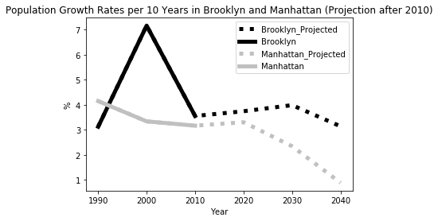
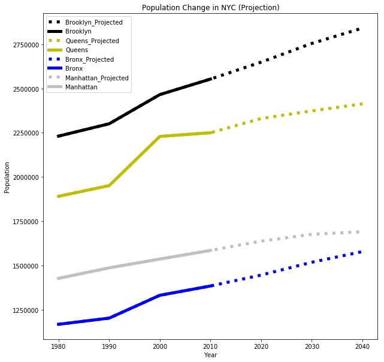

# HW11

## Questions and Tasks
HW11 is devided into two parts.

-MTA data wrangling and Randomtree. Use numpy 3D data and create time-series.
-Plotting along with advises that we got from peers. Descriptions are below.

## Contributions
HW11 has been done by Kenji Uchimoto by himself. 

## Acknowledgements
Fu, TA, gave me instructions about the assignments. 

## Assignment2
Original

Renewed

Figure1
Original Description: Figure1 shows population growth rates in Brooklyn and Manhattan (Projection after 2010). The data was retrieved from NYC open data, New York City Population by Borough, 1950 - 2040 and converted to growth rates. 
We can see that after 2020 the rate of Manhattan drops drastically while that of Brooklyn keeps about 3%. 

Along with advises, I changed
- y_label
As a referees mentioned, I use raw number instead of percentage because it would generate one more information, i.e. difference of scales among boroughs here.

- # of boroughs
To add other boroughs' data are useful if it does not make the graph messy. 

- color 
One referee mentioned to use color as black and gray is not interesting. And, this time, we have 4 boroughs, so we need new colors in addition to black and gray. I chose brue and yellow for new colors because those are understandable for most color blind people. 
